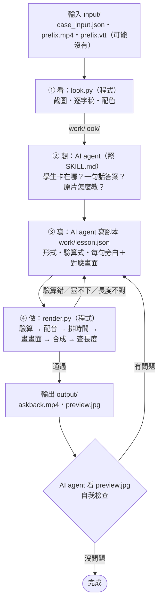

# AskBack AI 老師 

學生看教學影片看到第 t 秒卡住了。這個 skill 讓 AI agent 接手：針對那一個困惑，
用原片的教法做一支 **30–90 秒**的補充教學影片，再把學生送回原片。

## 給 agent（Claude Code／Codex）

**請完整讀過 [`SKILL.md`](SKILL.md)，照它的四個步驟做。** 摘要：

- 輸入：執行目錄下的 `input/case_input.json`、`input/prefix.mp4`，有字幕的題目另有 `input/prefix.vtt`（沒有也能做）。
- 輸出：**`output/askback.mp4`**（與 `input/` 同一層），30–90 秒、有畫面有語音、繁體中文、帶「AI 生成教學示範，非原講者本人」角標。
- 流程：`scripts/look.py`（看）→ 你自己想清楚並寫出 `work/lesson.json`（想、寫）→ `scripts/render.py`（做）。
- 不需要金鑰。需要 Python 3.9+；ffmpeg 沒有的話會由 `imageio-ffmpeg` 提供。

```bash
python3 -m pip install -r <這個repo>/requirements.txt
python3 <這個repo>/scripts/look.py          # 看：整理題目、截圖、逐字稿
#   …讀材料、想清楚、寫 work/lesson.json（寫法見 SKILL.md，範例在 examples/）…
python3 <這個repo>/scripts/render.py        # 做：驗算 → 配音 → 合成 → output/askback.mp4
```

## 系統流程



- **程式做兩頭**：前面把影片變成 AI 看得懂的材料，後面把腳本變成影片。
- **AI 做中間**：理解問題、決定教法、寫腳本。
- **兩個回頭的迴圈**：程式檢查不過會擋下來；通過後 AI 還要自己看預覽圖再檢查一次。

`team/` 是組員的協作紀錄與測試成果，不屬於 skill；產生影片時不要讀取或複製其中的檔案。

## 設計：五條規則

1. 一支影片只解一個困惑。
2. 一句話只做一件事（一句旁白＝一個畫面動作）。
3. 一個畫面只放一個重點。
4. 能沿用原片的，就不要自己做。
5. 能算的，就不要用想的。

對應到評分：

| 評分項目 | 這個 skill 怎麼處理 |
|---|---|
| 內容正確 35% | 每個數字寫成 `checks` 由程式驗算，不成立就不出片；畫面上的字與算式一律由程式排版，不交給生圖模型 |
| 回應提問、適合程度 30% | 先寫出「一句話的答案」才准動筆；固定五段：接住 → 點破 → 示範 → 收束 → 銜接；用詞限制在原片與學生已知概念內 |
| 延續原片教法 20% | 四種形式（黑板手寫／投影片／角色對話／實驗截圖標註）依原片選；顏色取自原片；優先直接沿用原片截圖與例子 |
| 影音品質 15% | 逐句配音、時間軸由實際語音長度決定；內建字幕；自動檢查 30–90 秒；輸出 `preview.jpg` 供回頭檢查 |
| 一定要產出影片 | 兩支腳本、四個純 Python 套件；語音有四層備援；字型隨 repo 附上 |

## 內容

```
SKILL.md            完整做法（agent 讀這份）
scripts/look.py     看：題目重點、縮圖、提問前截圖、逐字稿、配色
scripts/render.py   做：lesson.json → output/askback.mp4
scripts/paint.py    選用：需要時生一張沒有字的插圖
examples/           三種形式的 lesson.json 範例（寫法參考，不是答案庫）
fonts/              芫荽 Iansui、Noto Sans TC（SIL OFL 1.1）
team/               組員協作區：文件、測試成果（不屬於 skill，見 team/README.md）
```

## 授權與來源

- 程式：MIT。字型：SIL Open Font License 1.1（見 `fonts/`）。
- 教材來自均一教育平台 Junyi Academy，CC BY-NC-SA 3.0 TW。產出的影片沿用相同授權，並在畫面標示來源。
- 本 skill 的輸出為 AI 生成教學示範，不代表均一平台或原講者背書，也不使用原講者的聲音或肖像。
